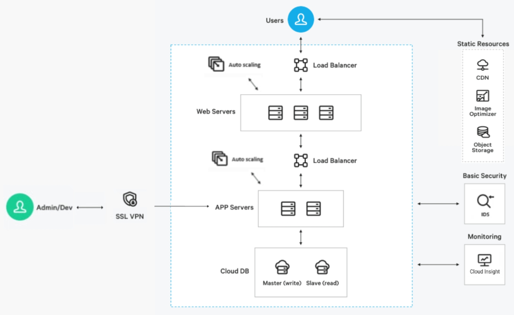

# NCP 3-Tier 이미지 플랫폼

네이버클라우드 플랫폼(NCP)을 기반으로 구축된 이미지 업로드·리사이즈·배포 서비스입니다.  
WEB–WAS–DB로 구성된 3-Tier 아키텍처와 CDN, Object Storage, Image Optimizer를 활용하여  
빠르고 안정적인 이미지 처리 서비스를 제공합니다.

---

## 전체 아키텍처 구조

---

## 프로젝트 소개

사용자가 이미지를 업로드하면 WAS가 Object Storage에 저장하고  
Image Optimizer가 자동으로 300×300 리사이즈 이미지를 생성합니다.  
CDN은 전 세계 사용자에게 빠르게 이미지 파일을 제공합니다.

---

## 시스템 구성 요소

### WEB Tier (Nginx)
- React 빌드 파일 제공  
- `/api` 요청 WAS 프록시  
- Auto Scaling Group 구성  

### WAS Tier (Spring Boot)
- 이미지 업로드 API  
- Object Storage 업로드 처리  
- Cloud DB(MySQL) 연동  

### Data Tier
- Cloud DB(MySQL) 복제본  
- Object Storage (원본/리사이즈 저장)  
- Backup Service (매일 06시)  

### Image Optimizer
- 원본 이미지 읽기  
- 300×300 리사이즈 이미지 생성  
- 리사이즈 이미지 저장  

### CDN
- 정적 파일 글로벌 캐싱  

### SSL VPN
- 운영자/개발자 내부 서버 접근  

### Cloud Insight
- CPU·MEM 임계치 알람  

---

## 배포 흐름

1. React 빌드 후 WEB 서버 배포  
2. Spring Boot JAR 빌드 후 WAS 서버 배포  
3. Load Balancer → WEB 서버 타겟팅  
4. WEB → WAS 프록시 구성  
5. Object Storage / Image Optimizer / CDN 연결  
6. Cloud DB 구성 및 백업 설정  
7. Cloud Insight 알람 설정  
8. SSL VPN 운영자 접근 허용  

---

## 기술 스택

**Frontend**
- React(Vite), Nginx

**Backend**
- Spring Boot 3.x  
- Java 17  
- JPA / Hibernate  

**Infra (NCP)**
- VPC / Subnet / Route Table  
- ACG(Security Group)  
- Load Balancer  
- Auto Scaling Group  
- Cloud DB(MySQL)  
- Object Storage  
- Image Optimizer  
- CDN  
- SSL VPN  
- Cloud Insight  
